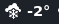
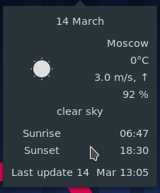
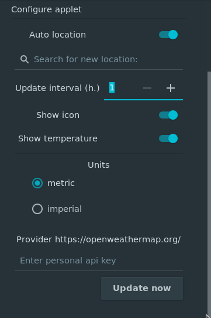

# weather-applet
A budgie-desktop applet to show weather in selected city.

  

### Popover
  

### Settings


---

## Dependencies
```
vala
gtk+-3.0 >= 3.18
budgie-1.0 >= 2
glib-2.0 >= 2.46.0
libpeas-1.0 >= 1.8.0
json-glib-1.0 >= 1.2
libsoup-2.4 >= 2.54
gweather-3.0 >= 3.18
```

### Installing from source
```
meson build --prefix /usr --buildtype=plain
ninja -C build
sudo ninja -C build install
```
